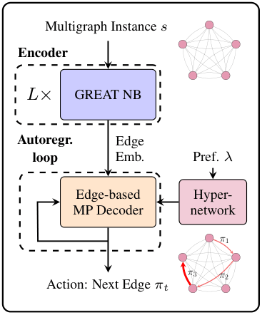
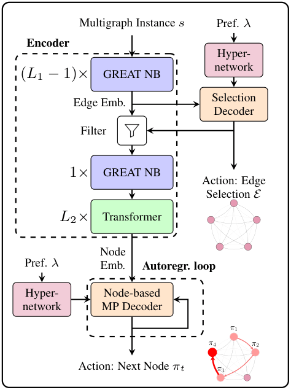

# GNN-based Multigraph Solver - GMS

Code for the ICLR2026 paper: [Beyond Simple Graphs: Neural Multi-Objective Routing on Multigraphs](https://openreview.net/forum?id=55laGcPNZZ)

**Figure: GMS-EB (left) and GMS-DH (right)**

<div style="text-align: center;">
    <table style="margin: auto;">
        <tr>
            <td></td>
            <td></td>
        </tr>
    </table>
</div>

## Basic Usage

The code is structured around model (GMS-DH or GMS-EB) and problem (MOTSP, MOCVRP, MGMOTSP, MGMOCVRP, MGMOTSPTW). For the MOTSP and MOCVRP, which are defined on simple graphs (not multigraphs), model selection is done in the train and test scripts. 

To train models, use the train.py script and to test use test.py. Parameters can be specified in these files. 

Some pre-trained models are available for each problem and distribution. More can be provided upon request to the authors. To run these, use the respective test_\*.py scripts. To train them from scratch, use the train_\*.py scripts.

Test data from the paper is available in each folder. 

## Reference

If you find our work useful, please consider citing our paper:
```
@inproceedings{rydin2026beyond,
  title={Beyond Simple Graphs: Neural Multi-Objective Routing on Multigraphs},
  author={Filip Rydin and Attila Lischka and Jiaming Wu and Morteza Haghir Chehreghani and Balázs Kulcsár},
  booktitle={International Conference on Learning Representations},
  year={2026},
  url={https://openreview.net/forum?id=55laGcPNZZ}
}
```

## Acknowledgements

This repository is based on the PMOCO repository: https://github.com/Xi-L/PMOCO

In turn, this is based on the POMO repository: https://github.com/yd-kwon/POMO

The code for GREAT is from: https://github.com/attila-lischka/GREAT

The code for the MP decoder is based on: https://github.com/Pointerformer/Pointerformer

If our code is helpful for you, please consider citing these works too. 